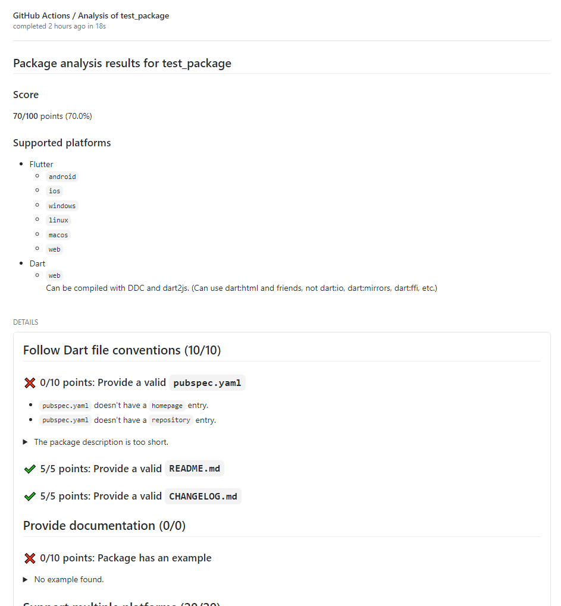

# Dart/Flutter package analyzer

This action uses the [pana (Package ANAlysis) package](https://pub.dev/packages/pana) to compute the score that your Dart or Flutter package will have on the [Pub site](https://pub.dev/help), and annotates your code, with suggestions for improvements.

This package, amongst other things:

* validates the code by performing static analysis with [dartanalyzer](https://dart.dev/tools/dartanalyzer),
* checks code formatting with [`dartfmt`](https://dart.dev/tools/dartfmt) or [`flutter format`](https://flutter.dev/docs/development/tools/formatting#automatically-formatting-code-with-the-flutter-command) (detected automatically),
* checks for outdated dependencies,
* validates the `pubspec.yaml` file (dependencies, description's length...),
* checks for required files (`CHANGELOG`, `README`, `example` folder...)
* ...

The pana package gives two scores: a [health score](https://pub.dev/help#health) and a [maintenance score](https://pub.dev/help#maintenance). Those scores are set in the outputs of this action, so you can use them in the next steps of your workflow (see below).

## Usage

You must include the `actions/checkout` step in your workflow. You **don't** need to run `pub get` or build a Dart container before.

This action uses its own Dart container. I recommend you to run it in a separate job, as [jobs run in parallel](https://help.github.com/en/actions/reference/workflow-syntax-for-github-actions#jobs).

Here's an example:

```yml
name: Example workflow
on: [push, pull_request]

jobs:

  package-analysis:

    runs-on: ubuntu-latest

    steps:
      - uses: actions/checkout@v2 # required

      - uses: axel-op/dart-package-analyzer@stable
        with:
          # Required:
          githubToken: ${{ secrets.GITHUB_TOKEN }}
          # Optional:
          relativePath: packages/mypackage/
          minAnnotationLevel: info
```

* `githubToken` input is required to post a report on GitHub. *Note:* the secret [`GITHUB_TOKEN`](https://help.github.com/en/actions/automating-your-workflow-with-github-actions/authenticating-with-the-github_token) is already provided by GitHub and you don't have to set it up yourself.
* If your package isn't at the root of the repository, use `relativePath` to indicate its location.
* If you only want to see annotations for important errors, try to change the `minAnnotationLevel` parameter to another value. Accepted values are `info`, `warning` and `error`. Defaults to `info` that posts all the annotations.

### Using the full Dart SDK

By default, this action uses the Dart SDK embedded in Flutter. It may not be the latest version of the Dart SDK. To use the latest version of the full Dart SDK, append `/with-full-sdk` to the path of this action.

In the example above, you would edit line 10 like this:

```yml
      - uses: axel-op/dart-package-analyzer/with-full-sdk@stable
```

This will slightly increase the time to pull the container that this action uses.

### Using the scores in your workflow

The health score and the maintenance score are set as outputs of this action. If you [set an id for this action](https://help.github.com/en/actions/automating-your-workflow-with-github-actions/workflow-syntax-for-github-actions#jobsjob_idsteps), you can use these outputs in the next steps of your workflow, as illustrated in this example:

```yml
name: Example workflow
on: [push, pull_request]

jobs:

  package-analysis:

    runs-on: ubuntu-latest

    steps:
      - uses: actions/checkout@v2

      - uses: axel-op/dart-package-analyzer@stable
        id: analysis # set an id for the current step
        with:
          githubToken: ${{ secrets.GITHUB_TOKEN }}

      # You can then use this id to retrieve the outputs in the next steps.
      # The following step shows how to exit the workflow with an error if a score is below 100:
      - name: Check scores
        run: |
          MAINTENANCE_SCORE=${{ steps.analysis.outputs.maintenance }}
          HEALTH_SCORE=${{ steps.analysis.outputs.health }}
          if (( $(echo "$MAINTENANCE_SCORE < 100" | bc) )) || (( $(echo "$HEALTH_SCORE < 100" | bc) ))
          then
            echo "Scores are not both equal to 100"
            exit 1
          fi
```

## Examples

### Report



### Diff annotations


